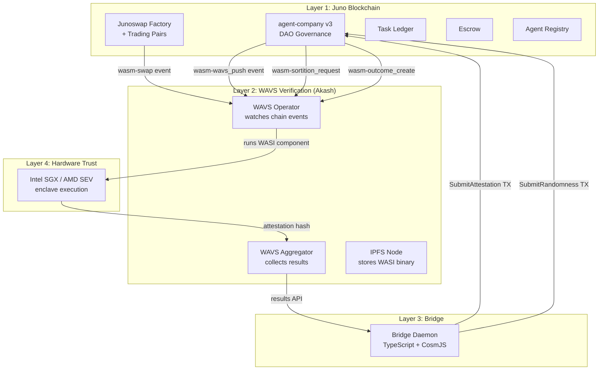
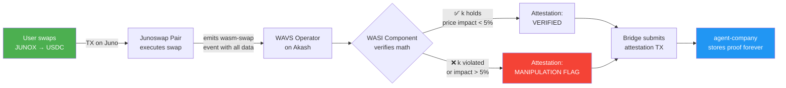
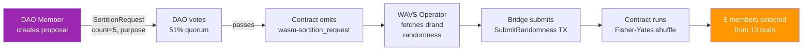
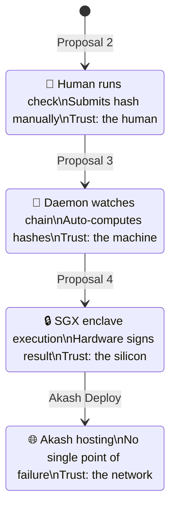
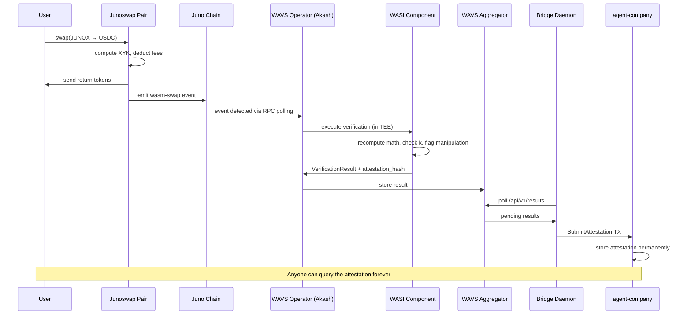
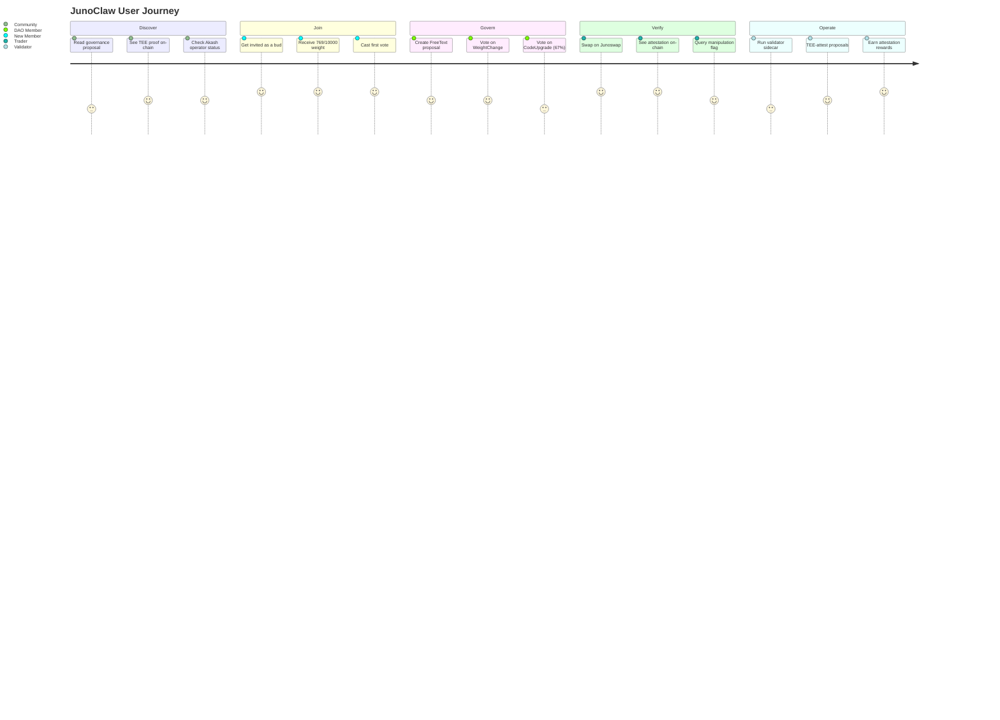
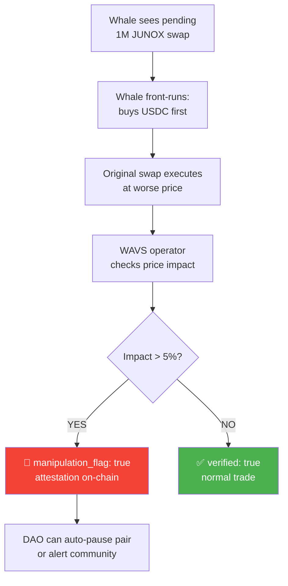

# JunoClaw — Visual Workflow Explainer

> **Purpose**: Break down JunoClaw for developers, validators, community members, and investors.
> **Visual tools**: Mermaid flowcharts, sequence diagrams, ASCII architecture, state machines, comparison tables, user journey maps.

---

## 1. THE ONE-LINER

**JunoClaw is a DAO that verifies DeFi trades using hardware-secured AI — running on fully decentralized infrastructure.**

```
Contracts on Juno  +  Verification on WAVS/TEE  +  Hosting on Akash  =  No trust required
```

---

## 2. THE 30-SECOND PITCH (Visual)

```
┌──────────────────────────────────────────────────────────────────┐
│                        TRADITIONAL DEFI                          │
│                                                                  │
│   User ──swap──▶ DEX ──tokens──▶ User                           │
│                   │                                              │
│                   └── "trust me, the math was right"             │
│                                                                  │
├──────────────────────────────────────────────────────────────────┤
│                        JUNOCLAW DEFI                             │
│                                                                  │
│   User ──swap──▶ DEX ──event──▶ WAVS Operator (in TEE)          │
│                   │               │                              │
│                   │               ├── recomputes XYK math        │
│                   │               ├── checks k invariant         │
│                   │               ├── flags manipulation         │
│                   │               └── attestation ──▶ ON-CHAIN   │
│                   │                                    forever   │
│                   └──tokens──▶ User                              │
│                                                                  │
│   Result: Every trade has a cryptographic proof. Queryable.      │
│           Permanent. Hardware-signed.                            │
└──────────────────────────────────────────────────────────────────┘
```

---

## 3. ARCHITECTURE OVERVIEW (Layered)



---

## 4. THE THREE WORKFLOWS (Flowcharts)

### Workflow 1: Swap Verification



**What the WASI component checks:**

```
┌─────────────────────────────────────────────────────────┐
│  INPUT (from wasm-swap event)                           │
│  ├── offer_asset:   ujunox                              │
│  ├── offer_amount:  1,000,000                           │
│  ├── return_asset:  uusdc                               │
│  ├── return_amount: 498,750                             │
│  ├── spread_amount: 1,250                               │
│  ├── fee_amount:    1,500                               │
│  ├── reserve_a:     10,000,000                          │
│  └── reserve_b:     5,000,000                           │
├─────────────────────────────────────────────────────────┤
│  VERIFICATION                                           │
│  ├── effective_price = 498750 / 1000000 = 0.49875       │
│  ├── spot_price     = 5000000 / 10000000 = 0.50000      │
│  ├── price_impact   = |0.49875 - 0.50| / 0.50 = 0.25%  │
│  ├── manipulation?  = 0.25% < 5% → NO ✅               │
│  └── k_post_swap    = res_a × res_b (must not decrease) │
├─────────────────────────────────────────────────────────┤
│  OUTPUT                                                 │
│  ├── data_hash:        SHA-256(all inputs)              │
│  ├── attestation_hash: SHA-256("swap_verify" + data)    │
│  ├── verified:         true                             │
│  └── manipulation_flag: false                           │
└─────────────────────────────────────────────────────────┘
```

### Workflow 2: Sortition (Random Jury Selection)



```
HOW FISHER-YATES WORKS (simplified):

Pool: [Alice, Bob, Carol, Dave, Eve, Fay, Greg, Hank, Iris, Jake, Kim, Leo, Max]
Randomness: 0x7a3f... (from drand beacon)

Round 1: SHA-256(randomness + 0) → index 7  → select Hank
Round 2: SHA-256(randomness + 1) → index 3  → select Dave
Round 3: SHA-256(randomness + 2) → index 11 → select Leo
Round 4: SHA-256(randomness + 3) → index 0  → select Alice
Round 5: SHA-256(randomness + 4) → index 8  → select Iris

Result: [Hank, Dave, Leo, Alice, Iris] — deterministic, verifiable, tamper-proof
```

### Workflow 3: Outcome Verification

```mermaid
flowchart LR
    A[Prediction market:<br/>"Will JUNO reach $1<br/>by April 2026?"] -->|outcome_create event| B[WAVS Operator]
    B --> C{WASI Component<br/>checks external data}
    C -->|fetches price feeds<br/>checks criteria| D[Attestation:<br/>RESOLVED or UNRESOLVED]
    D --> E[Bridge submits<br/>to agent-company]
    E --> F[Market settles<br/>winners paid out]

    style A fill:#607D8B,color:white
    style F fill:#4CAF50,color:white
```

---

## 5. TRUST LEVELS (State Machine)



```
TRUST PROGRESSION:

Level 0: "I checked it myself"              → Manual attestation
Level 1: "My computer checked it"           → Autonomous operator
Level 2: "The hardware guarantees the code"  → TEE enclave (Intel SGX)
Level 3: "Nobody can shut it down"           → Decentralized hosting (Akash)
Level 4: "Multiple validators confirm it"    → Validator sidecar set (NEXT)

Each level REMOVES a layer of human trust. That's the whole point.
```

---

## 6. GOVERNANCE MODEL (Tree Diagram)

```
                    GENESIS SEED
                   (100% weight)
                        │
                   ┌────┴────┐
                   │ BUDDING │  ← WeightChange proposal
                   └────┬────┘
                        │
        ┌───┬───┬───┬───┼───┬───┬───┬───┬───┬───┬───┬───┐
        │   │   │   │   │   │   │   │   │   │   │   │   │
       B1  B2  B3  B4  B5  B6  B7  B8  B9  B10 B11 B12 B13
      769 769 769 769 769 769 769 769 769 769 769 769 769
                        │
                   Genesis keeps
                    3/10000
                   (symbolic)

VOTING RULES:
┌─────────────────────┬──────────────┬──────────────┐
│ Proposal Type       │ Quorum       │ Buds Needed  │
├─────────────────────┼──────────────┼──────────────┤
│ FreeText            │ 51%          │ 7 of 13      │
│ WeightChange        │ 67%          │ 9 of 13      │
│ WavsPush            │ 51%          │ 7 of 13      │
│ SortitionRequest    │ 51%          │ 7 of 13      │
│ CodeUpgrade         │ 67%          │ 9 of 13      │
└─────────────────────┴──────────────┴──────────────┘
```

---

## 7. DATA FLOW (Sequence Diagram)



---

## 8. INFRASTRUCTURE MAP (Where Things Run)

```
┌──────────────────────────────────────────────────────────────────┐
│                    THE JUNOCLAW STACK                             │
│                                                                  │
│  ╔══════════════════════════════════════════════════════════╗     │
│  ║  JUNO BLOCKCHAIN (juno-1 / uni-7)                       ║     │
│  ║  ┌──────────────┐ ┌──────────┐ ┌───────────────────┐   ║     │
│  ║  │agent-company │ │Junoswap  │ │ Task Ledger +     │   ║     │
│  ║  │   v3 (DAO)   │ │Factory+  │ │ Escrow + Registry │   ║     │
│  ║  │  code_id=63  │ │2 Pairs   │ │                   │   ║     │
│  ║  └──────────────┘ └──────────┘ └───────────────────┘   ║     │
│  ╚══════════════════════════════════════════════════════════╝     │
│                          ▲ events        │ TXs                   │
│                          │               ▼                       │
│  ╔══════════════════════════════════════════════════════════╗     │
│  ║  AKASH NETWORK (provider.akash-palmito.org)             ║     │
│  ║  ┌──────────────┐ ┌──────────────┐ ┌──────┐            ║     │
│  ║  │wavs-operator │ │wavs-aggregator│ │ IPFS │            ║     │
│  ║  │ 2 CPU, 4GB   │ │ 1 CPU, 1GB   │ │512MB │            ║     │
│  ║  │ watches Juno │ │ :31812       │ │:5001 │            ║     │
│  ║  └──────────────┘ └──────────────┘ └──────┘            ║     │
│  ║  Cost: US$7.85/month | 3 containers | chain healthy     ║     │
│  ╚══════════════════════════════════════════════════════════╝     │
│                                                                  │
│  ╔══════════════════════════════════════════════════════════╗     │
│  ║  TEE HARDWARE (proven on Azure DCsv3)                   ║     │
│  ║  Intel SGX enclave → /dev/sgx_enclave                   ║     │
│  ║  Same WASI component, hardware-signed attestation       ║     │
│  ║  Proposal 4 TX: 6EA1AE79...D26B22 (on-chain forever)   ║     │
│  ╚══════════════════════════════════════════════════════════╝     │
│                                                                  │
│  ╔══════════════════════════════════════════════════════════╗     │
│  ║  BRIDGE DAEMON (runs anywhere — your laptop, server)    ║     │
│  ║  Polls aggregator → submits attestations to Juno        ║     │
│  ║  TypeScript + CosmJS | stateless | crash-safe           ║     │
│  ╚══════════════════════════════════════════════════════════╝     │
└──────────────────────────────────────────────────────────────────┘
```

---

## 9. COMPARISON TABLE (Why JunoClaw vs Others)

```
┌────────────────────┬──────────────┬──────────────┬──────────────┬───────────────┐
│ Feature            │ Traditional  │ Chainlink    │ EigenLayer   │ JUNOCLAW      │
│                    │ DEX          │ Oracles      │ AVS          │               │
├────────────────────┼──────────────┼──────────────┼──────────────┼───────────────┤
│ Chain              │ Any          │ Ethereum     │ Ethereum     │ Juno (Cosmos) │
│ Verification       │ None         │ Price feeds  │ Generic      │ Per-swap math │
│ Hardware trust     │ No           │ No           │ Optional     │ SGX/SEV TEE   │
│ Decentralized host │ No           │ Partial      │ No           │ Akash Network │
│ DAO governance     │ Multisig     │ None         │ Token voting │ 13-bud tree   │
│ Manipulation detect│ No           │ No           │ No           │ Per-trade     │
│ Open source        │ Sometimes    │ Partial      │ Partial      │ 100% Apache 2 │
│ Cost               │ $0           │ $$$          │ $$           │ $7.85/month   │
│ Cosmos native      │ Varies       │ No           │ No           │ Yes           │
└────────────────────┴──────────────┴──────────────┴──────────────┴───────────────┘
```

---

## 10. USER JOURNEY MAP



---

## 11. THE ATTESTATION LIFECYCLE

```
BIRTH                          LIFE                           FOREVER
─────                          ────                           ───────

Swap happens     ──▶    WAVS catches event    ──▶    Attestation on-chain
on Junoswap             WASI verifies math            Queryable by anyone
                        TEE signs result              Block height recorded
                        Bridge relays TX              Manipulation flag set
                                                      Hash is permanent

  ~ 1 block              ~ 5-10 seconds               ~ eternity
  (6 seconds)            (compute + submit)            (blockchain storage)
```

```
QUERY THE PROOF:

junod query wasm contract-state smart juno1k8dxll...stj85k6 \
  '{"get_attestation":{"proposal_id":4}}'

Response:
{
  "task_type": "swap_verify",
  "data_hash": "9d0f7354...",
  "attestation_hash": "945a53c5...",
  "block_height": 11735127,
  "verified": true,
  "manipulation_flag": false
}
```

---

## 12. REAL-WORLD SCENARIOS

### Scenario A: Whale Front-Running Detection



### Scenario B: Dispute Resolution via Sortition

```
PROBLEM: Two DAO members disagree on a proposal outcome.

SOLUTION:
1. Any member creates SortitionRequest(count=5, purpose="dispute_123")
2. DAO votes → passes (7/13 buds)
3. WAVS operator fetches drand randomness (round 4,291,337)
4. Contract selects 5 random jurors: [Bob, Eve, Greg, Iris, Leo]
5. Jurors vote on the dispute
6. Majority wins → dispute resolved

WHY THIS WORKS:
- Nobody chose the jurors (drand is unpredictable)
- The selection is deterministic (same randomness → same jurors)
- The hardware signed it (TEE attestation)
- It's on-chain (auditable forever)
```

### Scenario C: Verifiable Prediction Market

```
MARKET: "Will Juno reach 100 validators by June 2026?"

1. Market created → wasm-outcome_create event emitted
2. Users stake JUNOX on YES or NO
3. At resolution date:
   - WAVS operator checks validator count from chain
   - WASI component verifies against criteria
   - Attestation submitted: RESOLVED(YES) or RESOLVED(NO)
4. Winners paid out automatically
5. Entire resolution trail is on-chain and hardware-attested
```

---

## 13. THE STACK IN ONE PICTURE

```
┌─────────────────────────────────────────────────────────────┐
│                                                             │
│    "Every swap verified. Every jury random. Every proof     │
│     on-chain. Every layer replaceable. Every line open."    │
│                                                             │
│  ┌─────────┐  ┌─────────┐  ┌─────────┐  ┌─────────┐      │
│  │  JUNO   │  │  WAVS   │  │  AKASH  │  │  drand  │      │
│  │contracts│  │  TEE    │  │ compute │  │randomness│      │
│  │  layer  │  │ verify  │  │ hosting │  │  source  │      │
│  └────┬────┘  └────┬────┘  └────┬────┘  └────┬────┘      │
│       │            │            │             │            │
│       └────────────┴────────────┴─────────────┘            │
│                         │                                   │
│                    ┌────┴────┐                              │
│                    │ BRIDGE  │                              │
│                    │ daemon  │                              │
│                    └────┬────┘                              │
│                         │                                   │
│                    ┌────┴────┐                              │
│                    │  DAO    │                              │
│                    │13 buds  │                              │
│                    └─────────┘                              │
│                                                             │
│  github.com/Dragonmonk111/junoclaw  |  Apache 2.0          │
│  Akash: http://provider.akash-palmito.org:31812             │
│  TEE TX: 6EA1AE79...D26B22 (uni-7, block 11,735,127)       │
│                                                             │
└─────────────────────────────────────────────────────────────┘
```

---

## How to Use These Visuals

| Visual | Best For | Tool |
|--------|----------|------|
| Section 2 (30-sec pitch) | Twitter, elevator pitch | ASCII (copy-paste anywhere) |
| Section 3 (Architecture) | Technical docs, GitHub README | Mermaid (renders on GitHub) |
| Section 4 (Workflows) | Blog posts, Medium article | Mermaid flowcharts |
| Section 5 (Trust levels) | Governance proposal, presentations | State diagram + ASCII |
| Section 6 (Governance) | Community explainer | ASCII tree |
| Section 7 (Sequence) | Developer docs, API reference | Mermaid sequence diagram |
| Section 8 (Infra map) | Investor deck, partner outreach | ASCII box diagram |
| Section 9 (Comparison) | Twitter threads, Medium | Table |
| Section 10 (User journey) | UX design, onboarding | Mermaid journey |
| Section 12 (Scenarios) | Blog, governance proposal | Mermaid + narrative |
| Section 13 (One picture) | README, social media header | ASCII summary |
